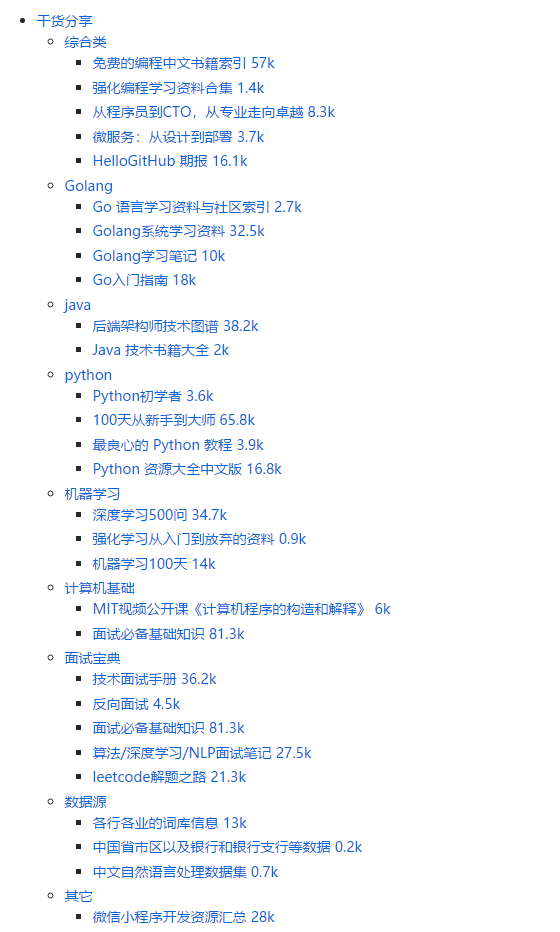

# 干货分享
> 均来自网络, 感谢各路大虾整理与总结.

## 综合类

### 免费的编程中文书籍索引 57k
> tips: 全中文技术文档,而且是免费的,在线资料. 从基础到各种少林绝学都有.
- https://github.com/justjavac/free-programming-books-zh_CN
 
### 强化编程学习资料合集 1.4k
> tips: 需要进阶的程序员必备.
- https://github.com/toutiaoio/weekly.manong.io

### 从程序员到CTO，从专业走向卓越 8.3k
> tips: 各大平台技术方案分享,内含175个技术分享PDF
- https://github.com/0voice/from_coder_to_expert

### 微服务：从设计到部署 3.7k
> tips: 微服务专题 
- https://github.com/DocsHome/microservices

### HelloGitHub 期报 16.1k
> tips: 分享 GitHub 上有趣、入门级的开源项目
- https://github.com/521xueweihan/HelloGitHub

## Golang
### Go 语言学习资料与社区索引 2.7k
> tips: 由unknwon整理,包含社区, 知识图谱,网站推荐,不同层次的golang学习资料推荐
- https://github.com/unknwon/go-study-index

### Golang系统学习资料  32.5k
> tips: 0基础学习golang,被翻译成10几门语言 
- https://github.com/astaxie/build-web-application-with-golang/

### Golang学习笔记 10k
> tips: 来自雨痕 
- https://github.com/qyuhen/book

### Go入门指南 18k
> tips: 入门者
- https://github.com/unknwon/the-way-to-go_ZH_CN

## java
### 后端架构师技术图谱 38.2k
> tips: 一些优质的博客,主要以java语言为主, 包含算法,并发, 操作系统,
> 设计模式,运维,中间件, 网络, 数据库, 搜索引擎, 性能, 大数据,安全, 分布式设计, 项目管理,技术资源.
- https://github.com/xingshaocheng/architect-awesome

### Java 技术书籍大全 2k
> tips: 书籍推荐, 主要以java为主, 比较全, 可以快速成长为一名架构师.
- https://github.com/sorenduan/awesome-java-books/

## python
### Python初学者 3.6k
> tips: 从入门到实践
- https://github.com/Yixiaohan/codeparkshare

### 100天从新手到大师 65.8k
- https://github.com/jackfrued/Python-100-Days

### 最良心的 Python 教程 3.9k
> tips:在线阅读: https://www.readwithu.com/
- https://github.com/TwoWater/Python

### Python 资源大全中文版 16.8k
> tips: 内容包括：Web 框架、网络爬虫、网络内容提取、模板引擎、数据库、
> 数据可视化、图片处理、文本处理、自然语言处理、机器学习、日志、代码分析等
- https://github.com/jobbole/awesome-python-cn

## 机器学习

### 深度学习500问 34.7k
> tips: 机器学习, 深度学习必备
- https://github.com/scutan90/DeepLearning-500-questions

### 强化学习从入门到放弃的资料 0.9k
> tips:为深度强化学习者提供资料.内含台湾李宏毅课.
- https://github.com/wwxFromTju/awesome-reinforcement-learning-zh

### 机器学习100天 14k
> tips: 翻译图书
- https://github.com/MLEveryday/100-Days-Of-ML-Code

## 计算机基础
### MIT视频公开课《计算机程序的构造和解释》 6k
> tips: 来自MIT
- https://github.com/DeathKing/Learning-SICP

### 面试必备基础知识 81.3k
> tips: 技术面试必备基础知识、Leetcode 题解、Java、C++、Python、后端面试、操作系统、计算机网络、系统设计
> 在线阅读: https://cyc2018.github.io
- https://github.com/CyC2018/CS-Notes

## 面试宝典
### 技术面试手册 36.2k
> tips: 纯英文的,比较全面的介绍技术面试的方方面面
- https://github.com/yangshun/tech-interview-handbook
- 介绍: https://mp.weixin.qq.com/s/aa6-lD2iRLBxf1hyggG1PA 

### 反向面试 4.5k
> tips: 有趣的逻辑思维
- https://github.com/yifeikong/reverse-interview-zh

### 面试必备基础知识 81.3k
> tips: 技术面试必备基础知识、Leetcode 题解、Java、C++、Python、后端面试、操作系统、计算机网络、系统设计
> 在线阅读: https://cyc2018.github.io
- https://github.com/CyC2018/CS-Notes

### 算法/深度学习/NLP面试笔记 27.5k
> tips: 2018/2019/校招/春招/秋招/算法/机器学习(Machine Learning)/深度学习(Deep Learning)/自然语言处理(NLP)/C/C++/Python/面试笔记
- https://github.com/imhuay/Algorithm_Interview_Notes-Chinese

### leetcode解题之路 21.3k
> tips: 图文并茂的解题思路
- https://github.com/azl397985856/leetcode

## 数据源
### 各行各业的词库信息 13k
tips: 结构化信息, 包含各行各业, 比如中英文敏感词, it词库, 成语词库
- https://github.com/fighting41love/funNLP

### 中国省市区以及银行和银行支行等数据 0.2k
> tips:踏破铁鞋无觅处得来全不费工夫
- https://github.com/ALawating-Rex/AreaAndBanks

### 中文自然语言处理数据集 0.7k
> tips: 各类的数据分析与收集.
- https://github.com/InsaneLife/ChineseNLPCorpus

## 其它
### 微信小程序开发资源汇总 28k
> tips: 收集了微信小程序开发过程中用到的工具与问题及资料.
- https://github.com/justjavac/awesome-wechat-weapp

